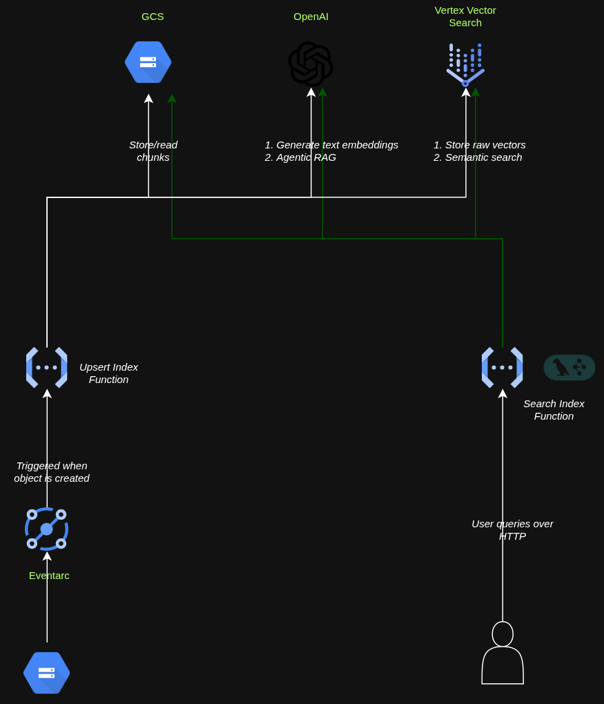

# Event-Driven RAG Pipeline on GCP

Retrieval-Augmented Generation (RAG) pipeline built on Google Cloud Platform using OpenTofu for Infrastructure as Code.

This repository demonstrates an event-driven architecture for document ingestion, embedding generation, vector indexing, and semantic retrieval using GCP Vector Search.

---

# Architecture Diagram




---

# Features

- Infrastructure provisioning using OpenTofu
- GCP Vector Search index + index deployment
- Event-driven document ingestion pipeline
- Automatic chunking and embedding generation
- Semantic search over HTTPS
- Modular chunking strategy design
- OpenAI embedding + LLM integration
- Custom service accounts for Cloud Functions
- Extensible architecture for additional chunking strategies

---

# What This Repository Does

This repository provisions and deploys an end-to-end semantic search pipeline on Google Cloud Platform.

## Infrastructure Provisioned

Using OpenTofu, the project provisions:

- Vertex AI Vector Search index
- Index endpoint deployment
- Cloud Storage bucket
- Two Cloud Functions
- Custom IAM service accounts and permissions

---

# Workflow

## 1. Document Upload

When a document is uploaded to the configured Cloud Storage bucket:

- `upsert_index` Cloud Function is automatically triggered
- The document content is extracted
- Text is chunked using the configured strategy
- Embeddings are generated using OpenAI embeddings
- Embeddings are synchronously uploaded to GCP Vector Search

---

## 2. Semantic Search

The `search_index` Cloud Function exposes an HTTPS endpoint.

The request payload contains user input/query text.

The function:

- Generates query embeddings
- Searches the vector index
- Retrieves relevant context
- Uses OpenAI LLM to generate a response
- Returns the generated answer

---

# Supported Chunking Strategies

Current implementation supports:

* Semantic chunking
    * Chunks based on paragraphs, sentences until desired chunk size is reached.
    * Simpler ingestion process and used in general purpose RAG
* Recursive chunking
    * Groups text based on contextual meanning and chunks
    * Helps preserve relationship between sentences and paragraphs.
    * Used in knowledge base and context senstive RAG

The architecture is intentionally modular so additional chunking strategies can be added easily.

Examples:

- Fixed-size chunking
- Sliding window chunking
- Markdown-aware chunking
- HTML-aware chunking
- Token-aware chunking

---

# Repository Structure

```text
.
├── gcp/
│   ├── infra.tf
│   ├── compute.tf
│   ├── variables.tf
│   └── outputs.tf
│
├── app/
│   ├── upsert_index/
│   └── search_index/
|
└── README.md
```

---

# Technologies Used

- Google Cloud Platform
- Vertex AI Vector Search
- OpenTofu
- Cloud Functions
- Cloud Storage
- OpenAI API
- Python

---

# Example Flow

```text
Document Upload
      ↓
Cloud Storage Event
      ↓
upsert_index Function
      ↓
Chunking
      ↓
Embedding Generation
      ↓
Vector Search Upsert
      ↓
HTTPS Query Request
      ↓
search_index Function
      ↓
Vector Retrieval
      ↓
LLM Response Generation
```

---

# Production Readiness Improvements

This repository is intended as a reference implementation and learning project.

To make it production-ready, the following enhancements should be implemented.

* Secrets manasgement to secure OpenAI keys
* CICD pipelines for infra and function code deployment
* Monitoring and alerting
* Batch ingestion and search
* Secure and monitor agents

---

# Disclaimer

This repository is intended for educational and reference purposes.

Additional security, scalability, reliability, and operational improvements are required before production deployment.

---

# License

MIT License